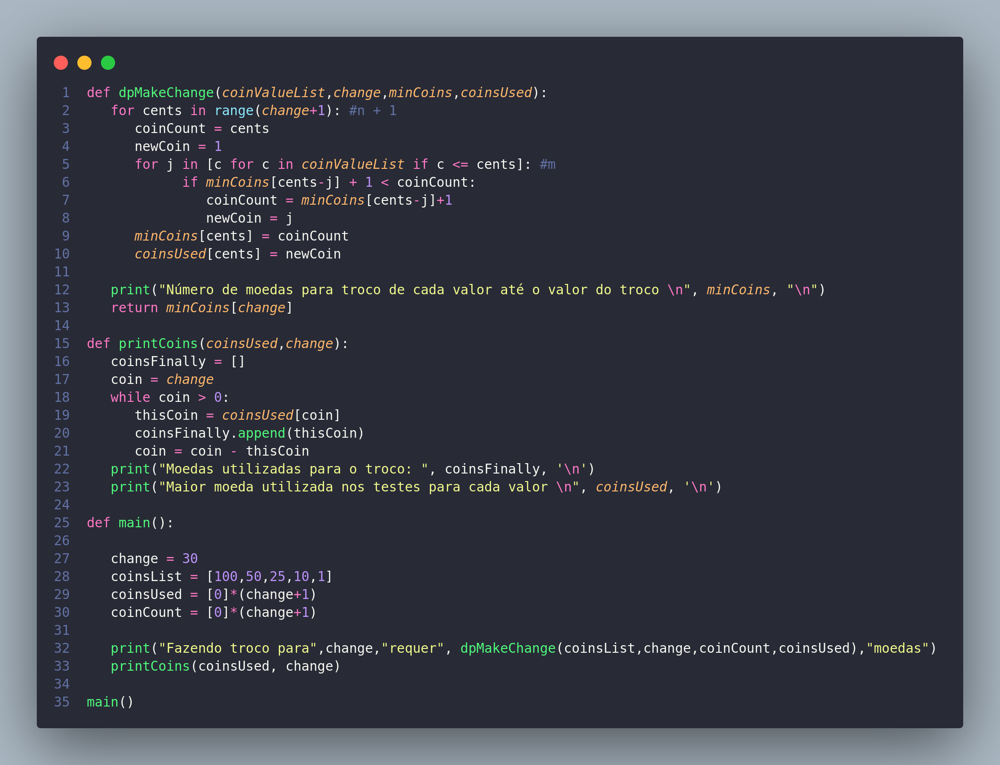

# Técnicas de Algoritmos

## Algoritmo de Força bruta

**Algoritmo combinações de caracteres**

 
 

## Algoritmo de Divisão e Conquista

**Algoritmo de Merge Sort**

 
 
    
## Algoritmo de Programação Dinâmica

**Algoritmo do Troco de moedas (cedulas)**

 
 

## Algoritmo de Recursividade

**Algoritmo de fatorial**

    
 
 

## Algoritmo Guloso

**Algoritmo do probblema da mochila**

    
 
 
