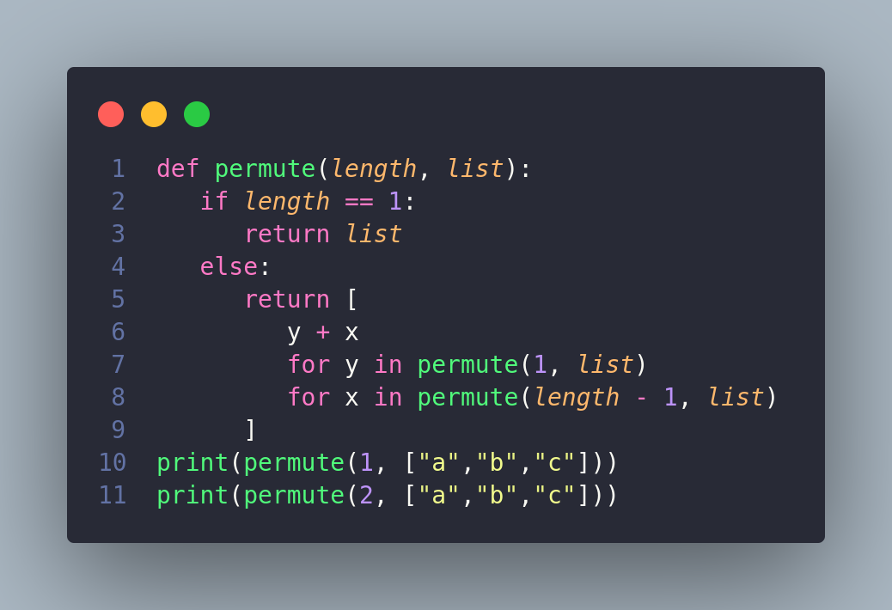
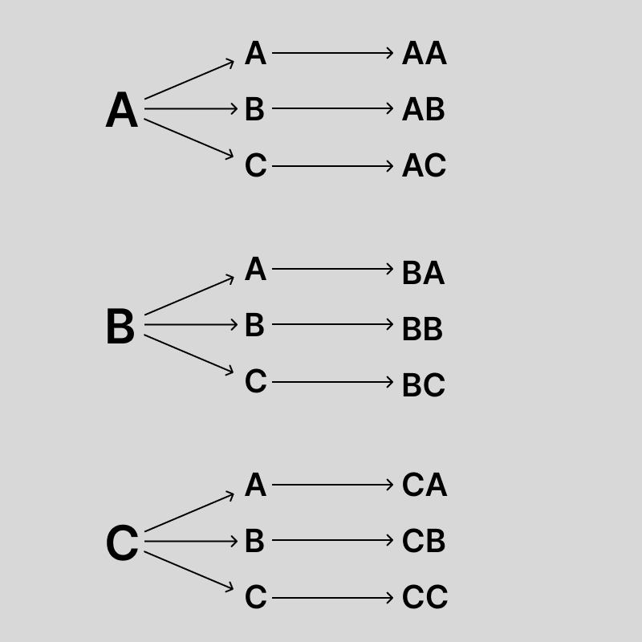
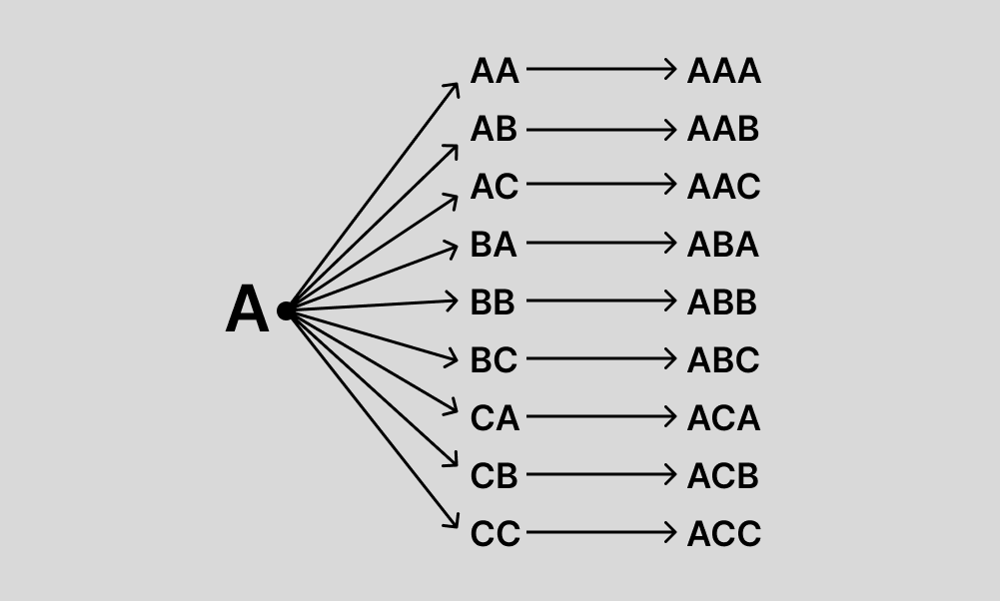

# Técnicas de Algoritmos

## Algoritmo de Backtracking

<h3 style="margin-left: 30px;">Backtracking é um tipo de algoritmo que representa um refinamento da  busca por força bruta.</h3>

 

## Problema: permutação.
 
 
 
 
 
 
 
 
 
 
 
 
 
 
 
 
 
 
 
 

## Algoritmo combinações de caracteres
  
 

 
 

 
 
 
 

