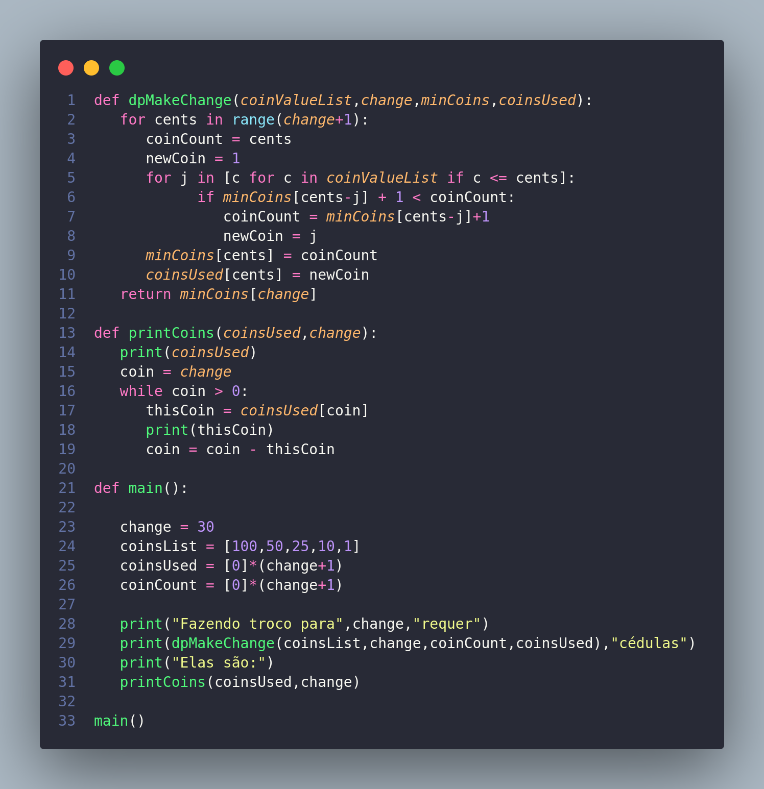
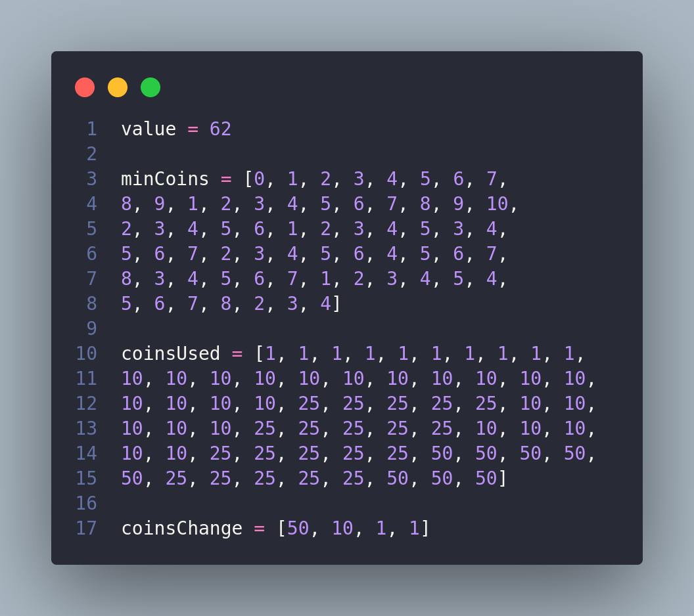

# Técnicas de Algoritmos

## Programação Dinâmica

<h3 style="margin-left: 30px;">Programação dinâmica é um método para a construção de algoritmos para a resolução de problemas computacionais, em especial os de otimização combinatória. Ela é aplicável a problemas nos quais a solução ótima pode ser computada a partir da solução ótima previamente calculada e memorizada</h3>

 

## Problema: A partir de um conjunto finito de moedas, deseja-se determinar o número mínimo de moedas que satisfaça um troco de um valor X

 
 
 
 
 
 
 
 
 
 
 
 
 
 
 
 

## Algoritmo Calculo do troco usando um número mínimo de moedas

  
 

 
 

